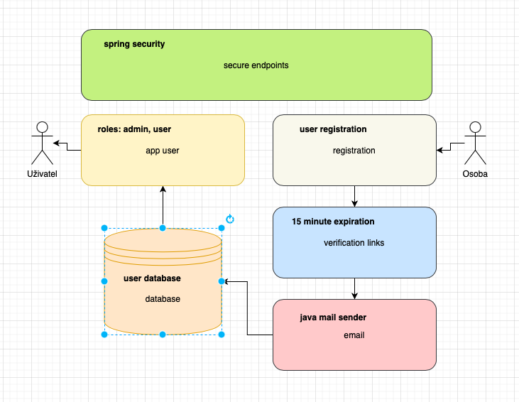

# Login Registration Backend

## Complete login registration backend system using Spring Boot.

- [x] Spring Boot

- [x] Spring Security

- [x] Java Mail

- [x] Email verification with expiry

## Project overview

- Creating diagram to understand the whole picture of the project in my mind: http://draw.io.

Specifically:

- Lombok DEVELOPER TOOLS
Java annotation library which helps to reduce boilerplate code.

- Spring Web WEB
Build web, including RESTful, applications using Spring MVC. Uses Apache Tomcat as the default embedded container.

- Spring Security SECURITY
Highly customizable authentication and access-control framework for Spring applications.

- PostgreSQL Driver SQL
A JDBC and R2DBC driver that allows Java programs to connect to a PostgreSQL database using standard, database independent Java code.

- Spring Data JPA SQL
Persist data in SQL stores with Java Persistence API using Spring Data and Hibernate.

- Java Mail Sender I/O
Send email using Java Mail and Spring Framework's JavaMailSender.

## Setting project

### Database setup

- 

